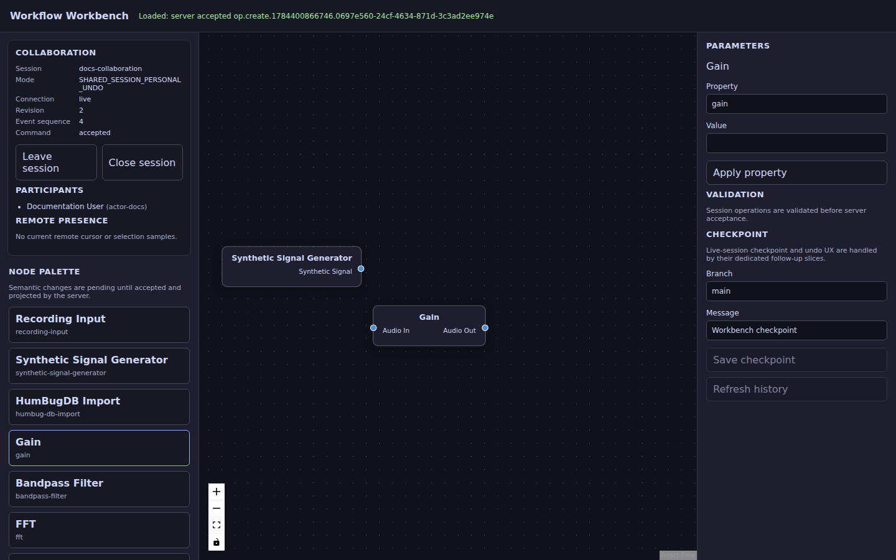
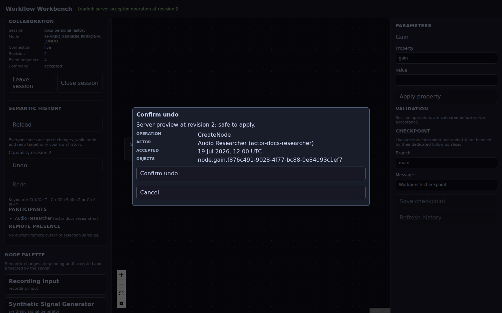

# Audio Analyzer

[](https://github.com/carstenartur/audio-analyzer/actions/workflows/maven.yml)
[](https://github.com/carstenartur/audio-analyzer/actions/workflows/collaboration-e2e.yml)
[](https://carstenartur.github.io/audio-analyzer/tests/surefire-report.html)
[](https://carstenartur.github.io/audio-analyzer/coverage/)
[](https://github.com/carstenartur/audio-analyzer/actions/workflows/codeql.yml)
[](LICENSE)
[](https://doi.org/10.5281/zenodo.21186367)
[](https://github.com/carstenartur/audio-analyzer/dependency-graph/sbom)

**Explore signals, reproduce experiments and design versioned audio-processing workflows in Java.**

Audio Analyzer combines a desktop signal workbench with a browser-based workflow editor. It is intended for people who want to inspect audio, compare processing results, build repeatable experiments or collaborate on a signal-processing graph without giving up deterministic Java models and auditable history.

The project provides real DSP and measurement foundations, recording and replay, evidence export, a server-authoritative workflow model and an experimental acoustic-localization plugin. It is a research and engineering workbench—not a validated species detector, safety system or turnkey digital audio workstation.

## What you can do

|             Goal              |                                       Current support                                       |
|-------------------------------|---------------------------------------------------------------------------------------------|
| Inspect a signal              | Waveform, phase, spectrum, spectrogram, RMS/peak measurements and diagnostic findings       |
| Compare processing behavior   | Deterministic demo sources, averaging, peak hold, recording/replay and Markdown A/B reports |
| Build a workflow visually     | Typed React Flow nodes and ports backed by immutable Java workflow models                   |
| Work with other people        | Shared sessions, ordered SSE updates, presence, revision conflicts and canonical reload     |
| Undo safely                   | Personal or explicit shared semantic undo/redo with previews, blockers and durable history  |
| Merge workflow versions       | Exact base/local/remote checkpoints, typed conflicts and validated merge commits            |
| Preserve evidence             | `.aar` recordings, CSV/PNG exports, evidence bundles and versioned workflow checkpoints     |
| Explore localization research | Simulated microphone arrays, TDOA, beamforming, tracking and HumBugDB-oriented experiments  |

## Choose your workbench

### Desktop signal workbench

Use the Swing application when the signal itself is the focus: live or deterministic input, waveform and spectrum inspection, recording, replay and evidence export.


### Web workflow workbench

Use the packaged web application when the processing graph, collaboration or version history is the focus. The browser is a rendering and input client; accepted workflow state remains server-owned.



The web workbench supports three immutable collaboration modes:

- **Private workspace** — one actor with personal undo and redo.
- **Shared session with personal undo** — everyone sees accepted changes, while an actor can undo only their own current operation.
- **Shared session with shared undo** — an explicitly selected shared operation can be undone only after a fresh server preview and confirmation.

See [Collaborative workflows](docs/features/collaborative-workflows.md) for the user workflow and generated screenshots.

## First run

Requirements:

- Java 21 or newer;
- the included Maven Wrapper;
- Docker only for optional Testcontainers/Playwright integration scenarios.

Build the project:

```bash
./mvnw clean package
```

Run the desktop workbench:

```bash
DESKTOP_JAR=$(find audio-app/target -maxdepth 1 -type f \
  -name 'audio-app-*.jar' ! -name '*-workbench.jar' -print -quit)
java -jar "$DESKTOP_JAR"
```

Run the web workflow workbench:

```bash
java -jar audio-app/target/audio-app-*-workbench.jar
```

Then open the local URL printed by the application. The initial graph is a read-only orientation example; create or join a collaboration session before editing.

Windows users should use `mvnw.cmd` and launch the unclassified `audio-app-<version>.jar` for the desktop or the `audio-app-<version>-workbench.jar` for the web application.

For a guided first experiment, continue with [Getting started](docs/getting-started.md).

## A practical first experiment

A useful introduction requires no microphone:

1. Start the desktop application with its deterministic demo source.
2. Inspect the repeating waveform and its dominant spectral peak.
3. Enable averaging or peak hold to compare steady and transient behavior.
4. Record a short `.aar` session and replay it through the same analysis path.
5. Start the web workbench and create a workflow session.
6. Add a signal generator and a gain stage.
7. Open the semantic history preview before undoing the latest operation.

This path demonstrates the central design goal: the same project supports immediate signal inspection and reproducible, version-aware workflow engineering.

## Collaboration is semantic, not browser-local

Workflow edits are typed operations such as creating a node, connecting ports or changing a property. The server validates the actor, collaboration mode and expected revision before appending a new canonical operation.

Undo and redo are also new audited semantic operations. They do not erase accepted history, rewrite Git commits or depend on a browser-local/Yjs undo stack. A full reload obtains the graph and current undo/redo capabilities from the server.



The production-packaged client is exercised with two isolated Chromium contexts. The test proves live convergence, stale-revision rejection, presence separation, reconnect/replay, full reload and personal/shared undo/redo without fixed-delay sleeps.

## Stable foundations and experimental research

### Stable foundations

- immutable audio blocks, format descriptors and deterministic generators;
- bounded buffering and reproducible DSP pipelines;
- sample decoding, FFT, spectrum, spectrogram and measurement snapshots;
- microphone-array calibration profiles with explicit timing offsets, drift and error budgets;
- recording/replay and evidence-oriented exports;
- immutable workflow models and deterministic serialization;
- packaged React Flow client with server-authoritative collaboration;
- semantic checkpoint comparison and validated three-way merge;
- Hibernate-backed session history, transactional outbox and migration validation;
- JGit-backed workflow checkpoints through the shared storage library;
- architecture tests, static analysis, coverage, CodeQL and reproducible screenshots.

### Experimental areas

The acoustic-localization plugin contains research-grade simulation, calibration-event estimation, TDOA correction, beamforming, tracking, wingbeat features and dataset-oriented classification baselines. It exposes synchronization mode, trust status and timing-error evidence in snapshots and exports. Real microphone-array localization still requires measured geometry and validated calibration; automatic beacon detection, cycle-slip repair and continuous resampling are not claimed.

The project deliberately keeps experimental claims separate from stable platform guarantees.

## Documentation

Start with the task that matches your goal:

- [Documentation home](docs/README.md) — guides organized for users, researchers, operators and contributors.
- [Getting started](docs/getting-started.md) — build, launch and first signal/workflow experiment.
- [Feature guides](docs/features/README.md) — signal inspection, recording, comparison and collaborative workflows.
- [Collaborative workflows](docs/features/collaborative-workflows.md) — sessions, revision safety and semantic undo/redo.
- [Semantic workflow merge](docs/architecture/semantic-workflow-merge.md) — exact checkpoints, conflict types, resolution and audit guarantees.
- [Experimental acoustic localization](docs/plugins/acoustic-localization.md) — capabilities, evidence and limitations.
- [Architecture](ARCHITECTURE.md) — audio, workflow, collaboration, persistence and module boundaries.
- [Persistent workbench operation](docs/workbench-hibernate-persistence.md) — Hibernate/JGit mode, migrations and outbox operation.
- [Development](docs/development.md) — build, tests, quality gates and generated documentation.
- [Plugin development](docs/development/plugin-development.md) — stable API, ServiceLoader registration and contribution design.
- [Roadmap](ROADMAP.md) — current open product and research work.

## Modules

```text
audio-core                  immutable audio and workflow domain contracts
audio-geometry              reusable 2D geometry and localization constraints
audio-acquisition           microphone metadata, arrays, sources and calibration evidence
audio-dsp                   decoding, DSP, analysis, diagnosis and recording
audio-plugin-api            stable host-facing plugin contracts
audio-experimental-acoustic optional localization and dataset research plugin
audio-web-editor            React Flow source and reproducible production assets
audio-app                   Swing UI, Spring Boot workbench, persistence and plugin host
```

The optional `workbench-screenshot-tests` profile exercises the packaged application with Testcontainers and Java Playwright. It is not part of the default Docker-free Maven reactor.

## Quality and reproducibility

Before a contribution is merged, the repository expects:

```bash
./mvnw clean verify
```

This includes tests, formatting, architecture checks, coverage and static analysis. Browser collaboration and documentation screenshots use dedicated opt-in workflows because they require Docker and Chromium.

Generated screenshots are executable documentation: the integration test creates the documented state, asserts its semantics and only then captures the image. Hand-edited screenshots are not treated as equivalent evidence.

## Citation and license

Releases are archived through Zenodo. Use the DOI badge above for the current citation record.

Audio Analyzer is licensed under the [MIT License](LICENSE).
