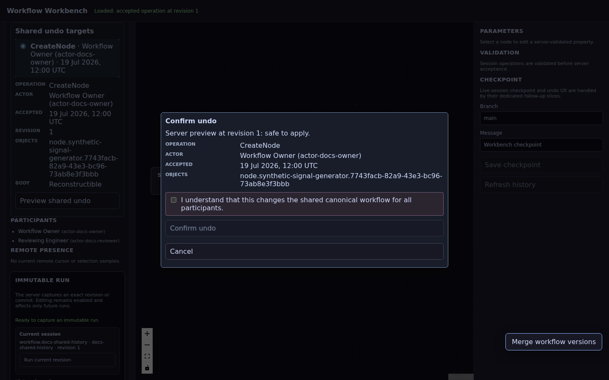

# Collaborative workflow design

The web workbench lets multiple browser actors edit one canonical audio-processing workflow. React Flow renders the graph and translates gestures into semantic commands; the server owns accepted state, revision ordering, durable history and undo eligibility.

## What collaboration changes

Without an active session, the initial workflow is a read-only example.

After a session is created or joined:

- node, edge and property changes become typed semantic operations;
- each command carries the actor and expected semantic revision;
- the server validates and appends accepted operations;
- ordered SSE delivers accepted projections and presence;
- stale commands are rejected without an optimistic graph residue;
- a reconnect or full page reload obtains canonical state from the server.

## Choose an undo model deliberately

The collaboration mode is immutable for a session.

### Private workspace

One actor owns the workspace. Undo and redo use that actor's durable semantic history.

### Shared session with personal undo

All participants see accepted changes. An actor may undo their own current operation when later semantic changes do not conflict with it.

The server does not silently skip a blocked operation. It reports the later operations and semantic object identifiers that prevent a safe inverse.

### Shared session with shared undo

Participants may inspect active operations from the shared durable history. No operation is selected automatically.

A shared undo requires:

1. explicit target selection;
2. a fresh server preview at the current revision;
3. review of actor, time, operation and affected objects;
4. acknowledgement that all participants' canonical graph will change;
5. final server revalidation.

## Personal undo preview

The preview is generated immediately before execution. It describes the exact target and whether the inverse is currently safe. Confirmation is disabled when later operations conflict with the target.

Undo is a new audited operation. The original operation remains in history.

## Shared undo preview

The target browser shows durable active operations with actor, timestamp, revision, affected objects and reconstructibility. Shared confirmation cannot be bypassed by a keyboard shortcut.

## Redo and repeated history actions

Redo targets an accepted undo operation owned by the requesting actor. It is rejected when the undo has already been reapplied, later semantic state conflicts or the expected revision is stale.

Repeated undo/redo cycles create new operation identities. They never remove earlier audit records.

## Reload and reconnect

The browser stores its actor identity and active session id in per-tab session storage when available.

A full reload:

1. reloads the ordinary orientation page;
2. rejoins the remembered session;
3. obtains session metadata and canonical projection;
4. opens ordered SSE from the accepted sequence;
5. reloads durable history and actor capabilities.

The legacy orientation projection is not allowed to overwrite an active session restored later in the same startup sequence.

When the SSE request fails, the client reconnects from its accepted sequence. Missing operations are replayed or a canonical snapshot is applied. The browser does not synthesize missing graph edits locally.

## Ambiguous transport results

A command may reach the server even if its HTTP response is lost. History commands therefore use a stable client-generated `commandId`.

After an ambiguous failure:

- the exact pending envelope remains visible;
- canonical session and durable history are reloaded;
- acceptance is proven only when durable history contains that command id;
- otherwise the user may retry the same envelope;
- a replacement command id is never generated for the uncertain submission.

## Presence is not workflow state

Selection, cursor or viewport information is actor-scoped presence. It helps collaborators understand each other's focus but does not enter:

- the canonical workflow DSL;
- semantic revision history;
- undo/redo eligibility;
- Git checkpoints;
- reproducibility input.

Remote presence expires independently of participant membership and workflow history.

## Keyboard behavior

- `Ctrl/⌘+Z` opens the same undo preview as the visible control.
- `Ctrl/⌘+Shift+Z` and `Ctrl/⌘+Y` open the redo preview.
- Shared undo still requires a selected target and acknowledgement.
- Shortcuts are ignored while focus is in an editable form control.

## Executable evidence

The dedicated two-browser suite runs the production-packaged application with two isolated Chromium contexts. It proves:

- live cross-browser projection convergence;
- remote presence outside canonical workflow state;
- stale-revision rejection;
- controlled SSE interruption and catch-up;
- full reload and session restore;
- personal undo and redo;
- shared target selection, acknowledgement, undo and redo.

The suite uses no fixed-delay sleeps. It waits only for observable revisions, connection states, HTTP responses and DOM visibility.

See [Two-browser collaboration end-to-end tests](../collaboration-e2e.md).

## Current boundaries

- The browser is not a semantic workflow engine.
- Yjs, when present, is not authoritative for nodes, edges or properties.
- A cached history row is descriptive; only a fresh preview and command authorize an inverse.
- Live-session checkpoint behavior remains separate from semantic editing.
- Full durable process-restart E2E coverage is still tracked by issue #249.

For implementation details, see:

- [React Flow session client](../architecture/react-flow-session-client.md)
- [Durable semantic undo and redo](../architecture/semantic-undo-redo.md)
- [Hibernate-backed persistence](../workbench-hibernate-persistence.md)
